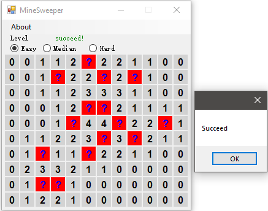

# Quick Headings
Last edited 2020-10-31, 20:08

This is a very simple minesweeper program written by C# in Visual Studio 2019. The key summaries are below for who wants to learn how to write this simple demo from the very begining.

## 0. How to click?
- Left click, explore this gird cell. 

- Middle click, explore the surrounded grid cells. 

- Right click, mark the mine with a question mark.

## 1. MineSweeping Algorithm
### 1.1 Variables
- `bool[] mines_grid` defines where stores the mine, where `true` means there is a mine at the grid cell. 

- `int n_mines` determines the number of mines.

- `int n_horizontal` and `int n_vertical` defines the grid shape.

- `int[] traverseMatrix` records whether a grid has been explored(clicked). All the values of `traverseMatrix` are initialized as `-1`. Once a grid cell has been explored, the value of this cell will be updated to the number of mines surrounded this grid cell.

- `bool[] markMatrix` records the players's flag on a grid cell, where `true` means a flagged grid cell as a reminder of a mine.

- `string status` defines the status of the current game, "on-going", "failed" or "succeed".

### 1.2 Algorithms
- How to find the connected grids when a grid cell is clicked?

    `void ExploreGrid(...)` is the core function to explore grid cells. Given a grid cell, DFS is used to traversed all the 8 adjacent grid cells. The most importanct recursion termiation criterions are "the grid cell has been marked by the user.", "there are at least one mines surrounding this grid cell." or "the grid cell itself is a mine." 
- How to initialize the mines?

    `Random` class is used to generate the random numbers.

## 2. GUI rendering

Remember that all the numbers, question marks and rectangles with color are generated by the code. Each time you clicked a grid cell, the GUI needs to be updated by `this.Refresh()` according to the current state variables of the game. 

See the details in `void Form1_Paint(object sender, PaintEventArgs e)`. You need to carefully write the logic of rendering which depends on several state variables. A good tip is to list a "truth table" when necessary. 

To avoid the laggy animation in rendering, set `this.DoubleBuffered = true`.

## 3. Truth table of mouse clicking
### 3.1 Left click
| mines_grid[i] | markMatrix[i] | traverseMatrix[i] >= 0 | Response |
| :-----------: |:-----------:  | :-----------:          |:-------: |
|0|0|0| explore |
|0|0|1| none |
|0|1|0| none |
|0|1|1| this case should not exist |
|1|0|0| explore |
|1|0|1| this case should never been reached,   since you already lose the game. |
|1|1|0| none |
|1|1|1| this case should not exist |
| | | | |

### 3.2 Right click
| mines_grid[i] | markMatrix[i] | traverseMatrix[i] >= 0 | Response |
| :-----------: |:-----------:  | :-----------:          |:-------: |
|0|0|0| mark |
|0|0|1| none |
|0|1|0| unmark |
|0|1|1| this case should not exist |
|1|0|0| mark |
|1|0|1| this case should never been reached,   since you already lose the game. |
|1|1|0| unmark |
|1|1|1| this case should not exist |
| | | | |

### 3.3 Middle click
| mines_grid[i] | markMatrix[i] | traverseMatrix[i] >= 0 | Response |
| :-----------: |:-----------:  | :-----------:          |:-------: |
|0|0|0| none |
|0|0|1| check whether to explore the neighbour cells |
|0|1|0| none |
|0|1|1| this case should not exist |
|1|0|0| none |
|1|0|1| this case should never been reached,   since you already lose the game. |
|1|1|0| none |
|1|1|1| this case should not exist |
| | | | |

